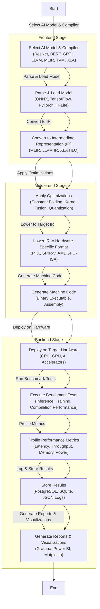

```mermaid
graph TD;
    
    %% Frontend Stage
    Start["Start"] -->|Select AI Model & Compiler| SelectModel;
    SelectModel["Select AI Model & Compiler\n(ResNet, BERT, GPT | LLVM, MLIR, TVM, XLA)"] -->|Parse & Load Model| ParseModel;
    ParseModel["Parse & Load Model\n(ONNX, TensorFlow, PyTorch, TFLite)"] -->|Convert to IR| ConvertIR;
    
    %% Middle-end Stage
    ConvertIR["Convert to Intermediate Representation (IR)\n(MLIR, LLVM IR, XLA HLO)"] -->|Apply Optimizations| OptimizeIR;
    OptimizeIR["Apply Optimizations\n(Constant Folding, Kernel Fusion, Quantization)"] -->|Lower to Target IR| LowerIR;
    LowerIR["Lower IR to Hardware-Specific Format\n(PTX, SPIR-V, AMDGPU-ISA)"] -->|Generate Machine Code| GenMachineCode;
    
    %% Backend Stage
    GenMachineCode["Generate Machine Code\n(Binary Executable, Assembly)"] -->|Deploy on Hardware| Deploy;
    Deploy["Deploy on Target Hardware\n(CPU, GPU, AI Accelerators)"] -->|Run Benchmark Tests| Benchmark;
    Benchmark["Execute Benchmark Tests\n(Inference, Training, Compilation Performance)"] -->|Profile Metrics| Profile;
    Profile["Profile Performance Metrics\n(Latency, Throughput, Memory, Power)"] -->|Log & Store Results| LogStore;
    LogStore["Store Results\n(PostgreSQL, SQLite, JSON Logs)"] -->|Generate Reports & Visualizations| Reports;
    Reports["Generate Reports & Visualizations\n(Grafana, Power BI, Matplotlib)"] --> End["End"];

    %% Grouping Sections
    subgraph Frontend [Frontend Stage]
        SelectModel --> ParseModel;
        ParseModel --> ConvertIR;
    end

    subgraph Middleend [Middle-end Stage]
        ConvertIR --> OptimizeIR;
        OptimizeIR --> LowerIR;
        LowerIR --> GenMachineCode;
    end

    subgraph Backend [Backend Stage]
        GenMachineCode --> Deploy;
        Deploy --> Benchmark;
        Benchmark --> Profile;
        Profile --> LogStore;
        LogStore --> Reports;
    end
```
